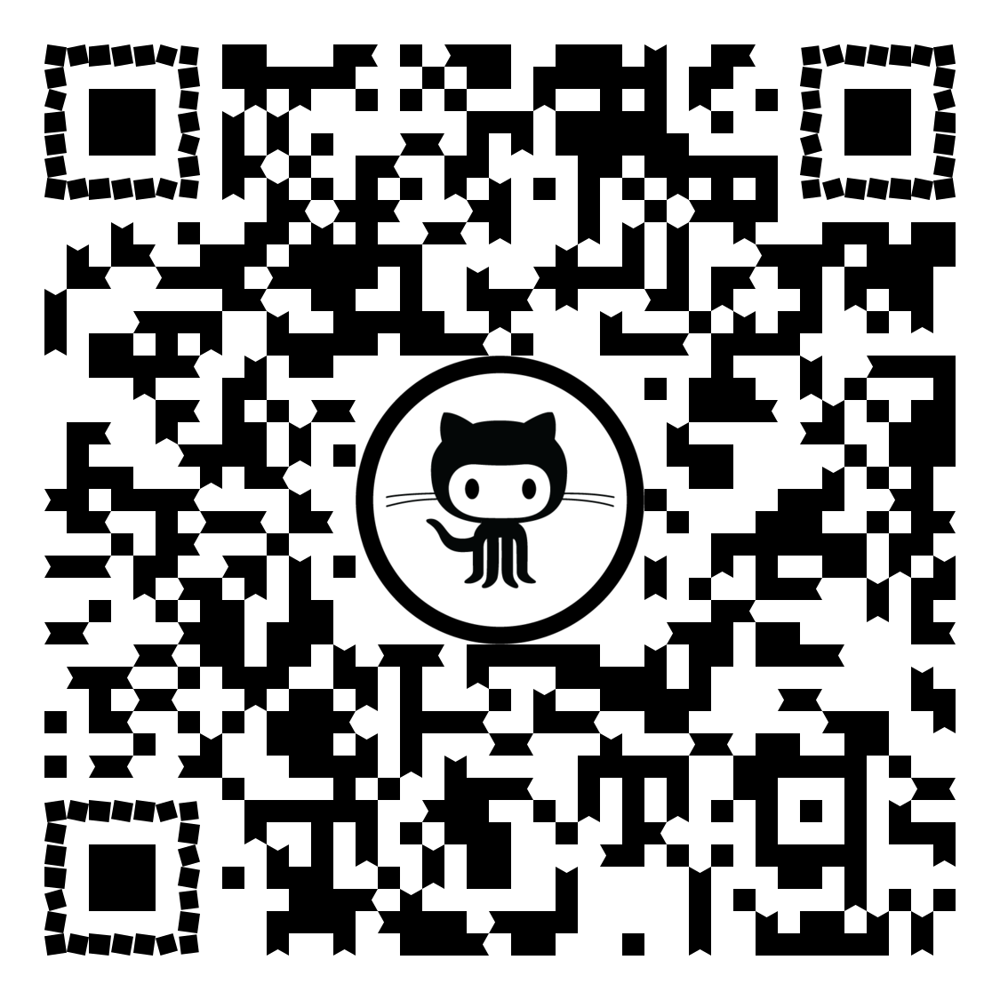

# Angular OnPush from A to Z

## Quick Start

```bash
git clone git@github.com:korniychuk/tech-talk-angular-on-push.git
cd tech-talk-angular-on-push
npm i
npm start
```

## Links

[ GitHub Repository](https://github.com/korniychuk/tech-talk-angular-on-push)  

[ www.korniychuk.pro](https://www.korniychuk.pro)

## Author

| [<br /><sub>Anton Korniychuk</sub>](https://korniychuk.pro) |
| :---: |
